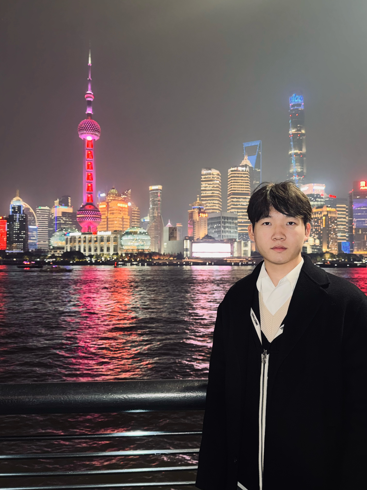

{: width="350px" style="float:left; padding-right:60px" }

# About Me

* I am a first-year Ph.D. student in Computer Science at [The Hong Kong Polytechnic University](https://www.polyu.edu.hk/). I previously earned my Master's degree from [The Hong Kong University of Science and Technology](https://hkust.edu.hk/) and my Bachelor of Science from [Chongqing University](https://www.cqu.edu.cn/).
* My research centers on Natural Language Processing (NLP) for Database, with a particular focus on query generation tasks. I am also deeply interested in leveraging mathematical optimization techniques to enhance the performance and reliability of deep learning algorithms.
* Beyond academics, I have a passion for basketball. During my time at [Chongqing University](https://www.cqu.edu.cn/), I had the honor of winning the Chongqing Championship in the CUBA second-level league.
* Check out more information from my [CV](https://zwanah.github.io/files/CV_WAN_Zhuoyue_25_1.pdf).
* Pronouns: he/him/his

